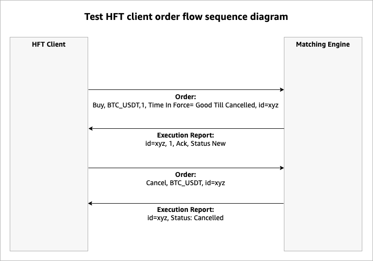

# AWS EC2 Network Latency Benchmark for Trading Applications

This repository contains a comprehensive network latency benchmarking solution designed specifically for trading applications running on AWS EC2. The benchmark suite measures round-trip latency between trading clients and servers, providing valuable insights for latency-sensitive financial applications.

## Project Overview

### Purpose
The primary goal of this project is to measure and analyze network latency in a simulated trading environment on AWS EC2 instances. In high-frequency trading (HFT) applications, even microseconds of latency can significantly impact trading outcomes and profitability. This benchmark helps:

- Evaluate the network performance of different EC2 instance types for trading workloads
- Measure the impact of various system and JVM optimizations on latency
- Provide data-driven insights for architecting low-latency trading systems on AWS
- Compare performance across different AWS regions and placement groups
- Identify bottlenecks and optimization opportunities in trading infrastructure

### Why This Matters
Financial markets operate at extremely high speeds, where being just a few microseconds faster than competitors can mean the difference between profit and loss. This benchmark suite allows you to:

1. Make informed decisions about EC2 instance selection for trading applications
2. Understand the real-world impact of system-level tuning on latency
3. Quantify the performance benefits of various optimization techniques
4. Establish baseline performance metrics for your trading infrastructure
5. Test the impact of network conditions on trading application performance

### Components

The benchmark suite consists of:

1. **Java Trading Client**: A high-performance client that sends limit and cancel orders and measures round-trip times
2. **Rust Mock Trading Server**: A lightweight server that simulates a trading exchange by responding to client orders
3. **CDK Infrastructure**: AWS CDK code to deploy the required EC2 instances and networking components
4. **Ansible Playbooks**: Scripts to provision instances, run tests, and collect results
5. **Analysis Tools**: Utilities to process and visualize latency data using HDR Histograms

### Sequence Diagram
The benchmark contains a simple HFT client and Matching Engine written in Java to simulate a basic order flow sequence for latency measurements, as per the following diagram:



## Prerequisites

Before using this benchmark suite, ensure you have the following prerequisites:

- **AWS CLI**: Configured with appropriate credentials and default region
- **AWS CDK**: Installed and bootstrapped in your AWS account
- **Ansible**: Version 2.9+ installed on your local machine
- **SSH Key Pair**: Generated and registered with AWS for EC2 instance access (e.g., `~/.ssh/virginia.pem`)

## Getting Started

### 1. Deploy Infrastructure with CDK

First, deploy the required AWS infrastructure using CDK. You have several deployment options:

#### Default Single Instance Deployment

```bash
cd deployment/cdk
npm install
cdk deploy
```

#### Client-Server Architecture with Cluster Placement Group

For optimal network performance between client and server, deploy them in a Cluster Placement Group:

```bash
cd deployment/cdk
npm install
cdk deploy --context deploymentType=cluster
```

You can also specify instance types for client and server:

```bash
cdk deploy --context deploymentType=cluster --context clientInstanceType=c7i.4xlarge --context serverInstanceType=c6in.4xlarge
```

#### Multi-AZ Deployment

To test latency across multiple availability zones:

```bash
cd deployment/cdk
npm install
cdk deploy --context deploymentType=multi-az
```

These commands will create EC2 instances in your AWS account according to the selected architecture.

### 2. Run the Benchmark Tests

After deploying the infrastructure, use the following Ansible playbooks to run the benchmark tests:

```bash
cd ../ansible

# Provision EC2 instances, and deploy both client and server applications
ansible-playbook provision_ec2.yaml --key-file ~/.ssh/your-key.pem -i ./inventory/inventory.aws_ec2.yml

# Stop any existing tests
ansible-playbook stop_latency_test.yaml --key-file ~/.ssh/virginia.pem -i ./inventory/inventory.aws_ec2.yml

# Apply OS-level performance tuning
ansible-playbook tune_os.yaml --key-file ~/.ssh/virginia.pem -i ./inventory/inventory.aws_ec2.yml

# Start the mock trading server
ansible-playbook restart_mock_trading_server.yaml --key-file ~/.ssh/virginia.pem -i ./inventory/inventory.aws_ec2.yml

# Start the HFT client
ansible-playbook restart_hft_client.yaml --key-file ~/.ssh/virginia.pem -i ./inventory/inventory.aws_ec2.yml

# Let the test run for desired duration, then stop it
ansible-playbook stop_latency_test.yaml --key-file ~/.ssh/virginia.pem -i ./inventory/inventory.aws_ec2.yml
```

### 3. Collect and Analyze Results

After running the tests, collect and analyze the latency results:

```bash
cd ..
./show_latency_reports.sh --inventory $(PWD)/ansible/inventory/inventory.aws_ec2.yml --key ~/.ssh/virginia.pem
```

This script will:
- Fetch histogram logs from the EC2 instances
- Process the logs to generate latency reports
- Create a summary report with key latency metrics
## Understanding the Results

The latency reports include several important metrics:

- **Min/Max/Mean Latency**: Basic statistics about the observed latencies
- **Percentile Latencies**: Values at key percentiles (50th, 90th, 99th, 99.9th, etc.)
- **Coordinated Omission Free**: Adjusted metrics that account for coordinated omission
- **Histogram Distribution**: Visual representation of the latency distribution

These metrics help identify not just average performance but also worst-case scenarios that are critical for trading applications.

## Advanced Configuration

### Tuning OS Parameters

The `tune_os.yaml` playbook applies various system-level optimizations:

- CPU frequency scaling and power management settings
- Network stack parameters
- IRQ affinity
- NUMA settings
- Kernel parameters

You can customize these settings in the playbook based on your specific requirements.

### JVM Tuning

The Java client is launched with specific JVM parameters to optimize performance. These parameters control:

- Memory allocation and garbage collection
- Thread affinity and scheduling
- JIT compilation behavior
- Memory pre-touch and large pages

### Optimization Techniques

The benchmark implements several optimization techniques commonly used in high-frequency trading applications:

1. **Thread Processor Affinity**: Pins threads to specific CPU cores to prevent cache thrashing
2. **Composite Buffers**: Reduces unnecessary object allocations and copy operations
3. **Separate Execution and IO Threads**: Keeps network I/O threads dedicated to communication
4. **HDR Histogram for Latency Recording**: Efficiently records latency measurements with high precision

## Contributing

See [CONTRIBUTING](CONTRIBUTING.md) for details on how to contribute to this project.

## License

This library is licensed under the MIT-0 License. See the LICENSE file.
